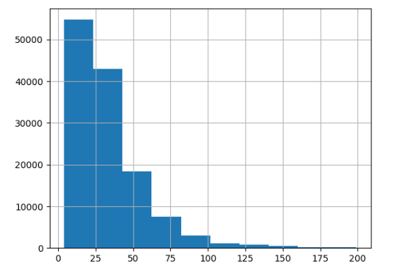
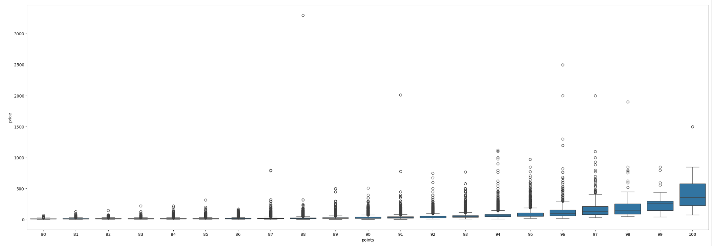
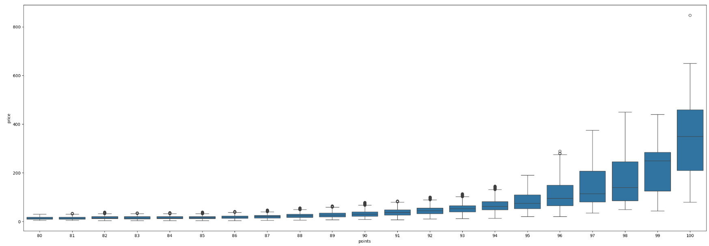
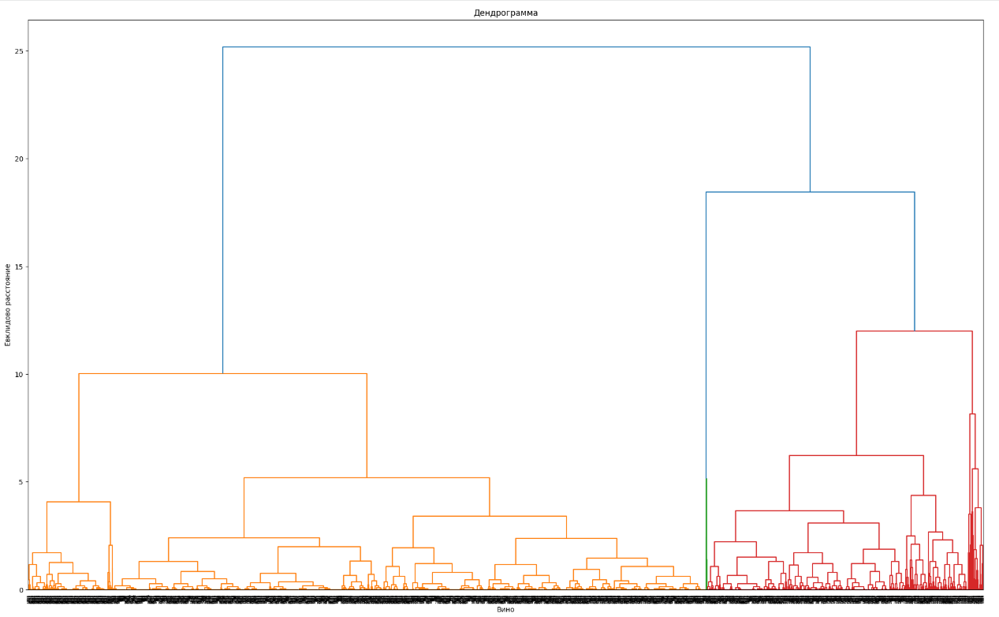
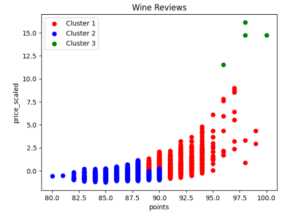
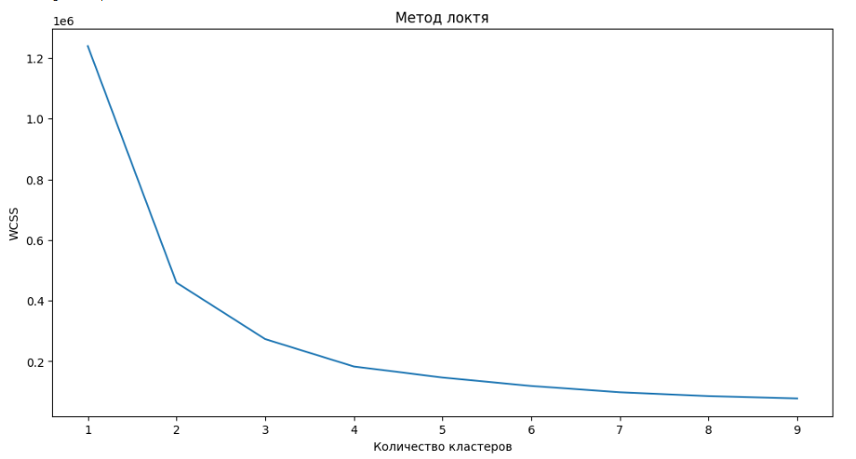
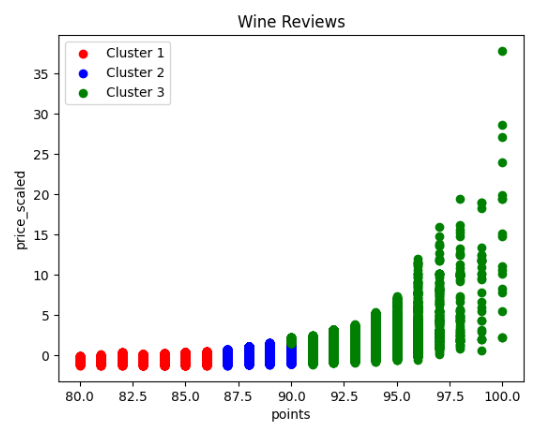

# Wine Reviews Clustering

Exploratory data analysis and clustering of the [Wine Reviews dataset](https://www.kaggle.com/datasets/zynicide/wine-reviews) (~130k wine reviews), grouping wines by taster rating (`points`) and `price`. Hierarchical clustering (complete / single / average linkage) is compared against K-means.

## Dataset

- **Source:** Wine Reviews, ~130,000 observations (`winemag-data-130k-v2.csv`)
- **Key fields used:** `points` (taster score, 1–100), `price` (bottle price)
- Missing `price` values were imputed with the mean price per `points` group; outliers were removed per `points` group using the IQR rule.

## Methods

1. **EDA** — missing values, outlier treatment (IQR per rating group), Spearman correlation between `points` and `price`
2. **Hierarchical clustering** on a subsample (first 3,000 rows) — complete, single, and average linkage, visualized with a dendrogram
3. **K-means clustering** on the full cleaned dataset — optimal `k` selected with the elbow method, k=3

## Results

**Price distribution** (bottles under $200):

**Outlier removal** — boxplots of `price` by `points`, before and after IQR-based cleaning:

| Before | After |
|---|---|
|  |  |

**Hierarchical clustering** — dendrogram and complete-linkage clusters (3,000-row subsample):

Single-linkage produced degenerate, chained clusters (a handful of outlier points split off while the rest stayed in one large cluster). Complete and average linkage gave more balanced groupings, though still sensitive to subsample size.

**K-means** — elbow method and final clustering (full dataset, k=3):

## Conclusions

- `points` and `price` show a noticeable positive Spearman correlation (≈ 0.68) — higher-rated wines tend to be more expensive.
- Single-linkage hierarchical clustering is unreliable here due to chaining; complete/average linkage are more usable but still limited by working on a small subsample.
- K-means on the full dataset yields three well-separated, interpretable segments:

| Cluster | Points (avg) | Price (relative) | Wines |
|---|---|---|---|
| 0 — Budget | 80–86 (84.7) | below average | ~32,300 |
| 1 — Mid-range | 87–90 (88.4) | around average | ~57,400 |
| 2 — Premium | 90–100 (92.3) | well above average | ~32,300 |

- The result confirms the expected "price ~ quality" relationship, and K-means on the full dataset gives a more interpretable, balanced segmentation than hierarchical clustering on a limited subsample.

## Tools

`pandas`, `numpy`, `scipy`, `seaborn`, `matplotlib`, `scikit-learn`

## Notebook

See [`wine_reviews_clustering.ipynb`](wine_reviews_clustering.ipynb) for the full analysis.
